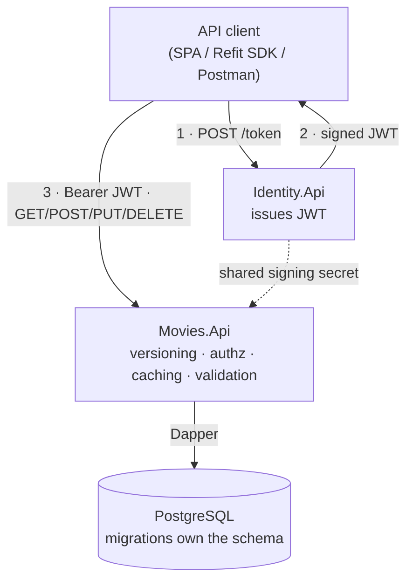

# TeweRestApi

[](https://github.com/hammayo/tewe-diary/actions/workflows/deploy.yml)
[](https://dotnet.microsoft.com/)
[](https://www.postgresql.org/)
[](https://www.docker.com/)
[](_docs/azure-deployment.md)

A production-shaped **.NET 9 REST API** for movies and ratings — a backend portfolio
piece that shows decisions an engineer I make end to end: clean layering, versioned
REST design, JWT + policy-based authorization, output caching, validation, Dapper/Postgres
with versioned migrations, a generated client SDK, a containerised local stack, a data
pipeline, and a full build → test → migrate → deploy path to Azure.

> The goal isn't feature count — it's **where boundaries go, how auth is modelled, how the
> data layer stays testable and how the whole thing ships.**

## What it demonstrates

| Area                 | Practice shown                                                                                                                    |
|----------------------|-----------------------------------------------------------------------------------------------------------------------------------|
| **API design**       | Resource-oriented routes, correct verbs + status codes, URL-segment **API versioning**, pagination, id-or-slug lookup             |
| **Architecture**     | Clean/layered design with an enforced inward **dependency rule**; DTO ↔ domain mapping isolated at the edge                       |
| **Security**         | JWT bearer auth from a **separate Identity service**; **policy-based** authorization (`Admin`, `Trusted`); API-key filter for ops |
| **Performance**      | Response **output caching** with **tag-based eviction** on writes                                                                 |
| **Data**             | **Dapper** over **PostgreSQL**; **FluentMigrator** versioned migrations; schema owned by migrations                               |
| **Testing**          | xUnit unit + **integration tests** against a real Postgres (Testcontainers), AAA style, `Bogus` data                              |
| **Tooling / DevOps** | Dockerised stack, a **CLI** for `migrate`/`import`, TMDB pipeline, **GitHub Actions** CI/CD with Azure Key Vault                  |

## System at a glance



## Quickstart

```bash
cp .env.example .env          # fill in real values (see Getting started)
bash scripts/stack-up.sh      # build + start Movies API, Identity, Postgres
# Movies API → https://localhost:7001  (Swagger at /swagger)
```

Full setup, config, ports, and a token-and-create-a-movie `curl` walkthrough are in
[Getting started](_docs/_getting-started.md).

## Documentation

| Doc                                                   | What's in it                                                             |
|-------------------------------------------------------|--------------------------------------------------------------------------|
| [Getting started](_docs/_getting-started.md)          | Prerequisites, `.env` config, ports/URLs, run, quickstart `curl`         |
| [Architecture](_docs/architecture.md)                 | Dependency rule, layering, request pipeline, project map                 |
| [API reference](_docs/api.md)                         | Endpoints, authorization tiers, query params, error contract, versioning |
| [Design decisions & notes](_docs/design-decisions.md) | The deliberate trade-offs and when to revisit them                       |
| [Testing](_docs/testing.md)                           | Unit + Testcontainers integration strategy and conventions               |
| [CI/CD & deployment](_docs/ci-cd.md)                  | Build→test→migrate→deploy, Key Vault, DB role separation                 |
| [Azure deployment runbook](_docs/azure-deployment.md) | Step-by-step `az`/`gh` provisioning to enable the deploy pipeline        |
| [Workflows reference](.github/workflows/_README.md)   | Operational detail for the GitHub Actions workflows                      |
| [TMDB import runbook](_docs/tmdb-import.md)           | Data pipeline: fetch → transform → load                                  |

## Attribution

Movie data and images come from [TMDB](https://www.themoviedb.org).
This product uses the TMDB API but is not endorsed or certified by TMDB.

## Roadmap

- **Minimal API v2** — a parallel `v2` surface built with **.NET Minimal APIs** will land in
  a dedicated **feature branch**, running side by side with the v1 controllers (URL-segment
  versioning already supports it); the SDK will grow a v2 client alongside it.
